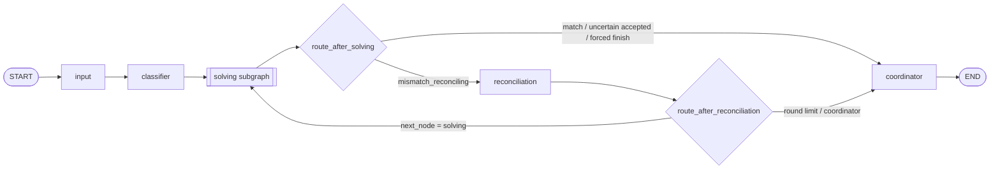
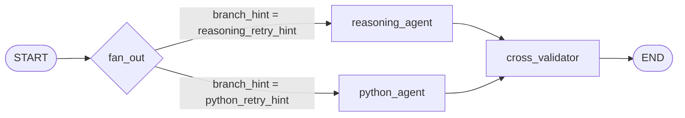

# ICMA-A Graph Architecture Based Mathematical Intelligence Agent System

本项目是一个面向数学题自动求解的多智能体系统。系统以 LangGraph 为编排框架，将数学题求解拆成 **领域分类、LLM 推理、Python/SymPy 验证、答案交叉校验、冲突调解、最终协调输出** 六个阶段，目标是在挑战杯评测接口中稳定返回结构清晰、答案明确、可追踪的 `final_response`。

项目入口保持竞赛约定：评测侧可以直接导入 `user_agent.py` 中的 `ReasoningAgent`，调用 `solve(problem, metadata)` 获得结果。本地调试时也可以运行 `main.py`，批量读取 JSONL 输入并为每道题写出独立 JSON 结果。

---

## 1. 项目定位

### 1.1 解决的问题

数学题自动求解常见问题包括：

- LLM 能写出推理，但数值计算、矩阵计算、积分求值等步骤可能出错。
- Python/SymPy 能做可计算验证，但证明题、条件解释、多问枚举和结论表达容易不完整。
- 领域判断错误会导致提示词、验证脚本和解题策略全部偏移。
- 输出如果只保留一个数字，可能丢失假设检验结论、置信区间双端点、运输方案、枚举对象等题面要求。

本系统采用图架构解决这些问题：先把题目路由到数学领域，再让 LLM 推理和 Python 验证并行生成候选答案，随后用规则与符号等价判定做交叉验证，必要时回到子图重试，最后由协调节点生成符合评测期望的简洁最终答案。

### 1.2 核心特性

- **LangGraph 主图 + 子图**：主图负责整体控制流，solving 子图负责双路并行求解。
- **18 个数学领域 skill 文档**：按领域加载 `skills_pythonscripts/<领域>/<领域>skill.md` 作为解题参考。
- **领域验证示例脚本**：按领域加载 `验证示例.py`，指导 Python agent 生成可执行验证代码。
- **LLM + SymPy 双路验证**：推理答案和程序答案独立生成，再做一致性判断。
- **答案契约检查**：针对多问、置信区间、假设检验、运输问题、枚举题等场景检查答案完整性。
- **冲突调解与重试**：当两路答案不一致或 Python 执行失败时，生成定向提示重跑 solving 子图。
- **可审计 trace**：输出包含分类、推理、Python 验证、交叉验证、调解、协调等阶段摘要。
- **断点续跑**：本地批处理时，已存在且非空的 `{idx}.json` 会自动跳过。

---

## 2. 目录结构

```text
.
├── main.py                         # 本地批处理入口：读 JSONL，并发调用 agent，写 JSON 输出
├── user_agent.py                   # 竞赛接口：ReasoningAgent.solve(problem, metadata)
├── langgraph_math_agent.py         # 主图构建：input -> classifier -> solving -> reconciliation -> coordinator
├── llm_client.py                   # OpenAI-compatible HTTP Chat 客户端，读取 INTERN_API_KEY
├── config.py                       # 全局配置：模型名、超时、重试、温度、token 预算
├── requirements.txt                # 运行依赖
├── graph/
│   ├── __init__.py
│   └── solving_subgraph.py         # solving 子图：reasoning_agent 与 python_agent 并行扇出
├── nodes/
│   ├── __init__.py
│   ├── input_node.py               # 初始化 idx
│   ├── classifier_node.py          # 领域分类：关键词/优先级/LLM JSON 分类/类别归一
│   ├── reasoning_agent_node.py     # LLM 结构化推理与最终答案抽取
│   ├── python_agent_node.py        # 生成 Python/SymPy 验证代码并执行
│   ├── cross_validator_node.py     # 推理答案与 Python 答案交叉验证，决定下一跳
│   ├── reconciliation_node.py      # 不一致时生成重试提示，控制重跑轮数
│   └── coordinator_node.py         # 汇总上下文，生成并格式化最终响应
├── state/
│   ├── __init__.py
│   └── math_agent_state.py         # MathAgentState：全图共享状态 TypedDict
├── utils/
│   ├── __init__.py
│   ├── deps.py                     # LangGraph configurable 依赖注入容器
│   ├── llm_retry.py                # LLM 调用重试与指数退避
│   ├── logger.py                   # stderr 日志，支持 python-json-logger
│   ├── token_budget.py             # 粗粒度 token 预算估算与 tight 模式
│   ├── timeout_control.py          # 通用超时包装
│   ├── prompt_templates.py         # 分类/推理/Python/协调 Prompt 模板
│   ├── skills_loader.py            # 领域扫描、skill 文档加载、关键词检索
│   ├── category_embedding_index.py # TF-IDF 领域相似度索引
│   ├── python_mcp_client.py        # Python executor 客户端，优先子进程，失败本地回退
│   ├── answer_matcher.py           # 数值/符号/字符串/证明题匹配
│   ├── answer_contract.py          # 题面字段契约与缺失组件检测
│   ├── answer_extractor.py         # 多问/残缺/LaTeX 片段等答案抽取工具
│   ├── answer_formatter.py         # 最终答案格式化与完整性回捞
│   ├── cot_stripper.py             # 去除模型 CoT 前缀和占位答案检测
│   └── error_handler.py            # 节点异常包装，写入 errors
├── mcp_servers/
│   └── python_executor/
│       ├── __init__.py
│       └── server.py               # Python 代码执行工具，可作为 FastMCP server 独立启动
└── skills_pythonscripts/
    ├── 数学分析/
    ├── 高等代数/
    ├── 抽象代数/
    ├── 概率论/
    ├── 统计推断/
    ├── 线性回归/
    ├── 随机过程/
    ├── 复分析/
    ├── 常微分方程/
    ├── 偏微分方程/
    ├── 泛函分析/
    ├── 测度积分/
    ├── 拓扑学/
    ├── 微分几何/
    ├── 数值分析/
    ├── 离散数学/
    ├── 运筹学/
    └── 非基础及进阶课程/
```

每个数学领域目录通常包含两个文件：

- `<领域>skill.md`：领域概念、典型题型、解题流程和注意事项。
- `<领域>验证示例.py`：该领域的 Python/SymPy 验证写法示例，供 `python_agent` 参考。

这些 `验证示例.py` 是运行时提示资料，不是测试目录。

---

## 3. 模型系统架构

### 3.1 总体图结构

主图定义在 `langgraph_math_agent.py`，状态类型为 `MathAgentState`。



主图节点职责：

| 节点 | 输入关键字段 | 输出关键字段 | 说明 |
|---|---|---|---|
| `input` | `metadata`, `idx` | `idx` | 提取题目编号，保证状态中存在 `idx`。 |
| `classifier` | `problem` | `category`, `category_confidence`, `candidate_categories` | 将题目归入真实存在的数学领域目录。 |
| `solving` | `problem`, `category`, retry hints | `reasoning_result`, `python_output`, `validation_status`, `validated_answer`, `next_node` | 子图内部并行求解并交叉验证。 |
| `reconciliation` | `validation_status`, `python_output`, `reasoning_result` | `reasoning_retry_hint`, `python_retry_hint`, `reconciliation_round`, `next_node` | 对不一致结果生成重试提示，最多重跑配置轮数。 |
| `coordinator` | 推理、Python、验证、调解状态 | `final_response`, `coordination_detail` | 生成面向评测的最终答案，并保留完整协调说明。 |

### 3.2 Solving 子图

`graph/solving_subgraph.py` 使用 LangGraph `Send` 从 START 同时扇出到两个 agent：



子图中的两条求解链路相互独立：

- `reasoning_agent` 只依赖题面、领域 skill 文档和重试提示，输出结构化推理。
- `python_agent` 只依赖题面、领域验证示例脚本和重试提示，输出可执行代码及执行结果。
- `cross_validator` 汇总两路结果，决定是否接受、调解或强制收敛。

### 3.3 依赖注入

`MathAgentGraph.run()` 会构造 `Deps` 并放入 LangGraph `configurable`：

```text
Deps(
  client=InternChatClient 或评测平台官方 client,
  skills_loader=SkillsLoader(),
  mcp_client=PythonMCPClient(),
  token_budget=TokenBudget(),
  logger=...
)
```

各节点通过 `utils.deps.get_deps(config)` 取依赖。这样节点函数保持纯函数形态，评测侧也可以用官方 client 初始化 `ReasoningAgent`。

### 3.4 状态模型

全图共享状态定义在 `state/math_agent_state.py`。关键字段如下：

| 阶段 | 字段 | 含义 |
|---|---|---|
| 输入 | `problem` | 原始题面文本。 |
| 输入 | `metadata` | 调用方传入的元信息，至少可能包含 `idx`。 |
| 输入 | `idx` | 题目编号；本地批处理未提供时使用 JSONL 行号。 |
| 分类 | `category` | 归一后的数学领域名，必须是 `skills_pythonscripts/` 下真实目录名。 |
| 分类 | `candidate_categories` | 可选领域候选列表。 |
| 推理 | `reasoning_result` | `analysis`, `steps`, `answer`, `validation_points`。 |
| 推理 | `reasoning_trace` | 推理节点内部重试记录。 |
| Python | `python_code` | 由模型生成并被执行的 Python 代码。 |
| Python | `python_output` | `success`, `stdout`, `stderr`, `answer`, `execution_time`, `execution_backend`。 |
| 验证 | `validation_status` | `match`, `mismatch_reconciling`, `mismatch_forced`, `uncertain`, `reconciled` 等。 |
| 验证 | `validated_answer` | 当前阶段选择出的答案。 |
| 调解 | `reconciliation_round` | 已调解轮数。 |
| 调解 | `reasoning_retry_hint`, `python_retry_hint` | 下一轮 solving 子图的定向提示。 |
| 输出 | `final_response` | 最终返回给评测系统的答案。 |
| 输出 | `coordination_detail` | coordinator 原始完整说明，写入 trace 供排查。 |
| 控制 | `next_node`, `should_terminate` | 图路由控制字段。 |
| 预算 | `token_budget_consumed` | 预留字段；实际预算由 `TokenBudget` 对象维护。 |

---

## 4. 端到端数据流

### 4.1 本地批处理入口

`main.py` 做四件事：

1. `load_jsonl(input_file)` 逐行读取输入。空行跳过；如果行内没有 `idx`，使用行号作为默认 `idx`。
2. 创建 `InternChatClient()` 和 `ReasoningAgent(client=client)`。
3. 按 `LOCAL_MAX_CONCURRENCY` 创建并发任务；默认并发数是 `8`。
4. 每道题写到 `{output_dir}/{idx}.json`。如果目标文件已存在且非空，则跳过该题，支持断点续跑。

输入 JSONL 最小格式：

```json
{"idx": 0, "problem": "设 f(x)=x^2，求 f'(3)。"}
```

`idx` 推荐显式提供；如果省略，本地 runner 会用该行的行号。

### 4.2 ReasoningAgent 接口

评测平台或业务代码可以直接调用：

```python
from llm_client import InternChatClient
from user_agent import ReasoningAgent

client = InternChatClient()
agent = ReasoningAgent(client=client)

result = agent.solve(
    problem="设 f(x)=x^2，求 f'(3)。",
    metadata={"idx": 0},
)
print(result["final_response"])
```

`solve()` 内部流程：

1. `create_initial_state(problem, metadata)` 生成初始状态。
2. `MathAgentGraph.run(initial_state, token_budget=TokenBudget())` 执行图。
3. 从最终状态中取 `final_response`，并调用 `_build_trace()` 组装审计信息。
4. `_validate_output()` 确认返回值是可 JSON 序列化的 dict，且 `final_response` 是非空字符串。

异常时不会抛出给 runner，而是返回：

```json
{
  "final_response": "解题过程中出现错误，无法给出完整答案。",
  "trace": [{"step": "error", "content": "...", "idx": 0}]
}
```

### 4.3 分类阶段

`nodes/classifier_node.py` 的目标是得到一个真实可加载的 `category`。

分类信号来源：

1. `SkillsLoader._scan_category_names()` 扫描 `skills_pythonscripts/` 下所有目录。
2. `DOMAIN_ALIASES` 提供每个领域的高频关键词。
3. `DOMAIN_PRIORITY_TERMS` 对容易混淆且评测关键的领域加权，例如线性回归、统计推断、数值分析。
4. `find_candidate_categories(problem, top_k=CONFIG["classifier_top_k"])` 返回关键词候选。
5. 分类 prompt 将候选领域、skill 摘要和题面一起发给 LLM，要求返回 JSON。

LLM 输出会经过 `_resolve_category()` 归一化：

- 精确匹配真实目录名。
- 去掉空白和中英文标点后匹配。
- 子串包含匹配。
- 最长公共子串匹配。
- Levenshtein 相似度兜底。
- 最后回退到关键词检索 top1。

这个步骤保证下游 `get_skill_document(category)` 和 `get_validation_script(category)` 不会因为虚构领域名而失败。

### 4.4 LLM 推理阶段

`nodes/reasoning_agent_node.py` 加载：

- `problem`
- `category`
- `skills_pythonscripts/<category>/<category>skill.md`
- 可选 `branch_hint`

然后使用 `REASONING_PROMPT` 要求模型输出固定章节：

- `## 问题分析`
- `## 详细解题步骤`
- `## 最终答案`
- `## 关键验证点`

节点会解析模型输出，得到：

```json
{
  "analysis": "...",
  "steps": [
    {"step_num": 1, "description": "..."}
  ],
  "answer": "...",
  "validation_points": ["..."]
}
```

答案抽取逻辑会避免常见残缺：

- 多行枚举题保留全部条目。
- 假设检验保留结论句，不只保留统计量。
- 多个等式和结论行一起保留。
- 避免把 LaTeX 公式切成碎片。
- 识别占位答案，如“见上文”“无法确定”等。

如果格式不完整，会在 `CONFIG["max_retries_per_node"]` 范围内重试。Token 预算紧张时，重试次数降为 1。

### 4.5 Python 验证阶段

`nodes/python_agent_node.py` 加载：

- `problem`
- `category`
- `skills_pythonscripts/<category>/<category>验证示例.py`
- 可选 `branch_hint`

模型必须输出 Python 代码块。代码抽取采用保守策略：

1. 优先提取独立的 Python fenced code block。
2. 如果 fence 不规范，只有内容看起来像代码时才提取。
3. 如果没有 fence，从第一行 `import` 或 `from` 开始提取。
4. 如果没有可信代码，返回空字符串并触发重试，避免执行模型的思维过程文本。

代码通过 `PythonMCPClient.execute()` 执行：

- 优先调用 `mcp_servers.python_executor.server.execute_python()`。
- 每次执行都创建独立临时 `.py` 文件。
- 通过子进程运行，超时由 `CONFIG["node_timeouts"]["python_mcp_execute"]` 控制。
- 子进程环境只保留 `PATH`, `HOME`, `LANG`, `LC_ALL`，避免把 API key 等敏感环境变量传给执行代码。
- stdout 中最后一个 `最终答案:` 之后的内容会被抽取为 `answer`。
- 子进程路径异常时，回退 `_exec_in_process()`。

返回示例：

```json
{
  "success": true,
  "stdout": "最终答案: 6\n",
  "stderr": "",
  "answer": "6",
  "execution_time": 0.43,
  "execution_backend": "mcp"
}
```

### 4.6 交叉验证阶段

`nodes/cross_validator_node.py` 调用 `AnswerMatcher.match_answers()`。

题型判断：

- 题面包含“证明”“prove”“show that”“验证”“说明”“推导”“论证”等关键词时，按证明题处理。
- 其他题默认按计算题处理。

计算题匹配策略：

1. 空答案和占位答案直接判为不可匹配。
2. 字符串完全相同则匹配。
3. 可以转成 float 时做数值容差比较。
4. 尝试做符号等价：
   - 归一化 Unicode 符号，如 `π`, `√`, `×`, `÷`, `²`。
   - 将常见 LaTeX，如 `\frac`, `\sqrt`, `\pi`, matrix 环境转成 SymPy 可解析文本。
   - 使用 SymPy `simplify`、矩阵比较和高精度数值比较。
5. 如果符号解析失败，退回字符串相似度。

证明题匹配策略：

- 推理步骤足够完整且 Python 验证成功，置信度较高。
- 推理完整但 Python 验证失败，仍可接受，因为证明题不一定适合程序验证。
- 推理不完整时，倾向不接受。

答案选择策略 `_preferred_answer()`：

- 计算题中 Python 成功且答案完整时，优先采用 Python/SymPy 答案。
- 证明题或 Python 失败时，优先采用 LLM 推理答案。
- 当推理答案缺少题面契约字段，而 Python 答案更完整时，改用 Python 答案。
- 两路都不完整时，取非空答案兜底。

### 4.7 答案契约检查

`utils/answer_contract.py` 从题面推断必须出现在答案中的组件，例如：

| 题面信号 | 必须覆盖的答案组件 |
|---|---|
| 假设检验、显著性水平、原假设 | 拒绝/不拒绝/接受等检验结论 |
| 双侧置信区间 | 区间上下端点 |
| 运输问题初始基可行解 | 至少两个形如 `x_ij = ...` 的分配量 |
| 比较题且题面要求建议/选择 | 明确建议、选择或优劣判断 |
| 回归矩阵方法 | 展示 `X^T X`、矩阵或相关中间矩阵 |
| 列出所有/互不同构 | 枚举多个对象 |

契约检查只做“是否残缺”的轻量判定，宁可漏报也避免误伤。它用于：

- cross-validator 在两路答案中选择更完整的一侧。
- formatter 从 coordinator 完整说明中回捞结论或区间。

### 4.8 调解阶段

`nodes/reconciliation_node.py` 不再额外调用 LLM 做决策，而是使用稳定规则：

- Python 执行失败：给 Python agent 生成修错提示，下一轮重点修代码。
- Python 成功但与推理不一致：两路都重跑，但不会把 Python 答案直接灌给推理侧，避免错误代码锚定推理。
- 达到 `CONFIG["reconciliation_max_rounds"]`：停止重跑，选择当前最可信答案进入 coordinator。

默认调解上限是 2 轮。Token 预算紧张时，上限降为 1 轮。

### 4.9 协调输出阶段

`nodes/coordinator_node.py` 汇总：

- 原题
- 分类领域
- 推理分析与步骤
- Python 代码和 stdout
- 验证状态
- `validated_answer`

然后使用 `COORDINATOR_PROMPT` 生成完整说明，最后交给 `post_process_final_response()` 收敛格式：

- 计算题：最终 `final_response` 尽量简洁，形如 `最终答案：{answer}`。
- 证明题：最终 `final_response` 保留结论和必要证明过程。
- 如果 coordinator 输出缺少题面要求，formatter 会尝试从完整说明中回捞缺失部分。
- `coordination_detail` 保存 coordinator 原始完整说明，写入 trace，便于后续排查。

---

## 5. 安装和运行

### 5.1 环境要求

- Python 3.10+ 推荐。
- 能访问 Intern-S / OpenAI-compatible Chat Completion 接口。
- Windows、Linux、macOS 均可运行；命令示例中的环境变量写法按系统选择。

安装依赖：

```bash
pip install -r requirements.txt
```

### 5.2 环境变量

| 变量 | 必需 | 默认值 | 说明 |
|---|---:|---|---|
| `INTERN_API_KEY` | 是 | 无 | Chat API key。`llm_client.py` 会自动补 `Bearer ` 前缀。 |
| `INTERN_API_BASE` | 否 | `https://chat.intern-ai.org.cn/api/v1/chat/completions` | OpenAI-compatible chat completions endpoint。 |
| `INTERN_MODEL` | 否 | `intern-s2-preview` | 使用的模型名称。 |
| `LOCAL_MAX_CONCURRENCY` | 否 | `8` | 本地批处理并发题数。 |

PowerShell 示例：

```powershell
$env:INTERN_API_KEY = "your-api-key"
$env:LOCAL_MAX_CONCURRENCY = "4"
python main.py --input_file .\input.jsonl --output_dir .\outputs
```

Bash 示例：

```bash
export INTERN_API_KEY="your-api-key"
export LOCAL_MAX_CONCURRENCY=4
python main.py --input_file input.jsonl --output_dir outputs
```

### 5.3 输入文件格式

输入文件必须是 JSONL，每行是一道题。最小字段：

```json
{"idx": 12, "problem": "设 X_1,...,X_n 来自正态总体，求均值的置信区间。"}
```

可附加其他元信息，例如 `subject`, `source`，但系统实际求解只依赖 `problem` 和 `idx`。不要把标准答案传给 `solve()` 或写入会被模型读取的元信息。

### 5.4 批量运行

```bash
python main.py --input_file input.jsonl --output_dir outputs
```

运行行为：

- 启动时读取全部 JSONL 条目。
- 每道题异步提交到线程池，实际调用 `ReasoningAgent.solve()`。
- 每题输出文件为 `outputs/{idx}.json`。
- 如果 `outputs/{idx}.json` 已存在且文件大小大于 0，则跳过该题。
- 任一题出错不会中断整个批次；该题写入 `status: "error"`。

### 5.5 输出格式

成功输出示例：

```json
{
  "idx": 0,
  "status": "success",
  "final_response": "最终答案：6",
  "trace": [
    {
      "step": "classification",
      "category": "数学分析",
      "confidence": 0.91,
      "candidates": ["数学分析", "高等代数"],
      "tools": [
        {
          "name": "category_candidates",
          "stages": ["all_categories", "keyword", "llm"],
          "selected": "数学分析"
        }
      ]
    },
    {
      "step": "reasoning",
      "attempts": 1,
      "answer": "6",
      "steps_count": 2
    },
    {
      "step": "python_verification",
      "attempts": 1,
      "success": true,
      "answer": "6"
    },
    {
      "step": "validation",
      "status": "match",
      "validated_answer": "6"
    },
    {
      "step": "coordination",
      "response_length": 5
    }
  ]
}
```

错误输出示例：

```json
{
  "idx": 0,
  "status": "error",
  "final_response": "",
  "error": {
    "type": "RuntimeError",
    "message": "..."
  },
  "trace": []
}
```

`final_response` 是最终评测答案；`trace` 是可选审计信息，不应包含 API key、访问令牌或个人敏感信息。

### 5.6 单题调试

可以临时创建一个 JSONL：

```json
{"idx": 1, "problem": "计算 \\int_0^1 x^2 dx。"}
```

运行：

```bash
python main.py --input_file one.jsonl --output_dir debug_outputs
```

查看：

```bash
cat debug_outputs/1.json
```

---

## 6. 配置说明

所有主要配置在 `config.py`。

| 配置项 | 当前默认值 | 作用 |
|---|---:|---|
| `model` | `intern-s2-preview` | 记录默认模型名；实际本地 client 读取 `INTERN_MODEL`。 |
| `max_retries_per_node` | `2` | reasoning/python 节点内部格式修复或代码修复重试次数。 |
| `llm_max_retries` | `3` | `chat_with_retry()` 对单次 LLM 请求的重试次数。 |
| `backoff_factor` | `2.0` | LLM 重试等待的指数退避因子。 |
| `node_timeouts.input` | `5` | input 节点预算时间。 |
| `node_timeouts.classifier` | `30` | 分类节点预算时间。 |
| `node_timeouts.solving` | `130` | solving 子图预算时间。 |
| `node_timeouts.reasoning_agent` | `120` | 推理节点预算时间。 |
| `node_timeouts.python_agent` | `60` | Python agent 预算时间。 |
| `node_timeouts.python_mcp_execute` | `30` | 单次 Python 代码执行超时。 |
| `node_timeouts.cross_validator` | `10` | 交叉验证预算时间。 |
| `node_timeouts.reconciliation` | `60` | 调解节点预算时间。 |
| `node_timeouts.coordinator` | `90` | 协调节点预算时间。 |
| `classifier_top_k` | `5` | 关键词候选领域数量。 |
| `classifier_confidence_threshold` | `0.7` | 分类置信度阈值预留配置。 |
| `computation_tolerance` | `1e-6` | 数值答案比较容差。 |
| `proof_confidence_threshold` | `0.7` | 证明题置信度阈值预留配置。 |
| `temperatures.classifier` | `0.1` | 分类低温输出，减少随机性。 |
| `temperatures.reasoning` | `0.2` | 推理较低温，兼顾稳定和表达。 |
| `temperatures.python` | `0.2` | 代码生成较低温。 |
| `temperatures.coordinator` | `0.3` | 最终表达稍高温。 |
| `max_tokens.*` | `32768` | 各 LLM 节点最大输出 token。 |
| `reconciliation_max_rounds` | `2` | 不一致时最多调解重跑轮数。 |
| `token_budget_max` | `256000` | 粗略 token 总预算。 |
| `token_budget_warn_ratio` | `0.9` | 达到该比例进入 tight 模式。 |
| `log_level` | `INFO` | 日志级别。 |
| `log_dir` | `logs` | 日志目录配置；当前日志主要输出 stderr。 |

---

## 7. MCP Python Executor

默认情况下无需手动启动 MCP server。`PythonMCPClient` 直接在进程内调用 `execute_python()`，而 `execute_python()` 自己会用子进程隔离执行模型生成的 Python 代码。

如果需要作为标准 FastMCP server 单独启动：

```bash
python -m mcp_servers.python_executor.server
```

执行安全边界：

- 每次代码运行写入临时 `.py` 文件。
- 使用当前 Python 解释器作为子进程。
- 超时后返回失败。
- 子进程环境不传递 API key。
- stdout 中最后一个 `最终答案:` 标记用于答案抽取。

该 executor 是数学验证工具，不应执行破坏性代码。生成代码的 prompt 会要求只使用 Python/SymPy 做计算，并以 `print("最终答案:", answer)` 收尾。

---

## 8. requirements.txt 依赖分组

依赖文件按用途分组：

- HTTP client：`requests`
- 图编排：`langgraph`, `langchain-core`
- MCP server 支持：`mcp`
- 数学计算：`sympy`, `mpmath`, `numpy`, `scipy`
- 领域检索：`scikit-learn`
- 字符串相似度：`python-Levenshtein`
- 类型兼容：`typing-extensions`
- 日志增强：`python-json-logger`

其中 `mcp` 主要用于独立启动 FastMCP server；默认 in-process 执行路径不需要外部 MCP transport，但保留依赖能保证 `python -m mcp_servers.python_executor.server` 可用。

---

## 9. 开发与发布注意事项

### 9.1 不应提交的内容

发布系统仓库时应排除：

- `tests/`
- `test_tmp/`
- `competition2/`
- `repair/`
- `.codegraph/`
- `__pycache__/`
- 本地输出目录，如 `outputs/`, `sample_outputs/`
- `.env`, `.env.*`, API key 或任何密钥文件

### 9.2 可以提交的运行时资料

应保留：

- `skills_pythonscripts/*/*skill.md`
- `skills_pythonscripts/*/*验证示例.py`

这些文件是分类、推理和 Python agent 的运行时上下文，缺失后系统会退化或直接无法读取对应领域资料。

### 9.3 密钥管理

不要在代码、README、输入数据或 trace 中写入真实 API key。`llm_client.py` 只从环境变量读取：

```text
INTERN_API_KEY
```

本地调试时用 shell 环境变量设置；提交仓库前确认没有 `.env` 或硬编码 token。

---

## 10. 常见问题

### 10.1 Missing API key

错误：

```text
RuntimeError: Missing API key. Set INTERN_API_KEY.
```

处理：设置环境变量后重新运行。

PowerShell：

```powershell
$env:INTERN_API_KEY = "your-api-key"
```

Bash：

```bash
export INTERN_API_KEY="your-api-key"
```

### 10.2 输出目录已有结果但想重跑

`main.py` 会跳过已存在且非空的 `{idx}.json`。删除对应文件或换一个 `--output_dir` 即可重跑。

### 10.3 Python 验证失败

查看输出 JSON 的 `trace` 中 `python_verification.tools[1].stderr`。常见原因：

- 模型没有输出合法 Python 代码块。
- 代码使用了当前环境没有安装的包。
- SymPy API 使用错误。
- 单题计算超过 `python_mcp_execute` 超时。

系统会在节点内部尝试修复代码；若仍失败，cross-validator 会根据题型决定是否调解重跑或采用推理答案。

### 10.4 分类领域不准确

分类由关键词、领域优先级和 LLM 共同决定。若某类题经常错分，可在 `utils/skills_loader.py` 中增强：

- `DOMAIN_ALIASES`
- `DOMAIN_PRIORITY_TERMS`
- 对应领域的 `skill.md` 标题和关键词

分类节点最终会把 LLM 返回类别归一到真实目录名，避免返回不存在目录。

### 10.5 final_response 太短或漏项

检查：

- `trace.validation.validated_answer`
- `trace.coordination.content`
- `utils/answer_contract.py` 是否覆盖该题型的字段契约
- `utils/answer_formatter.py` 是否能从 coordinator 完整说明中回捞缺失信息

对于多问题、假设检验、置信区间和运输方案，应优先增强契约检查和 formatter 回捞逻辑。

---

## 11. 最小复现清单

1. 安装依赖：

```bash
pip install -r requirements.txt
```

2. 设置 API key：

```bash
export INTERN_API_KEY="your-api-key"
```

3. 准备 `input.jsonl`：

```json
{"idx": 0, "problem": "计算 \\int_0^1 x^2 dx。"}
```

4. 运行：

```bash
python main.py --input_file input.jsonl --output_dir outputs
```

5. 查看：

```bash
cat outputs/0.json
```

预期输出中应包含非空 `final_response`，并带有分类、推理、Python 验证和协调 trace。
